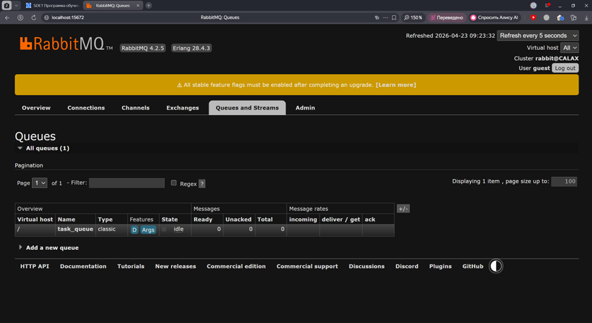
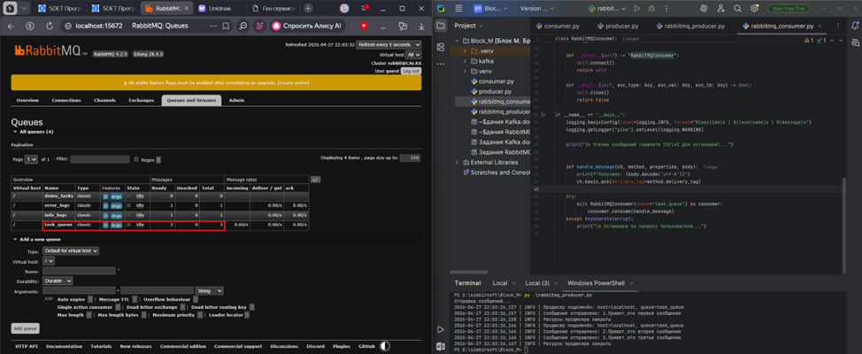
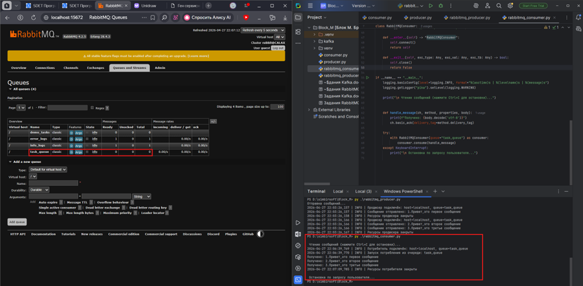
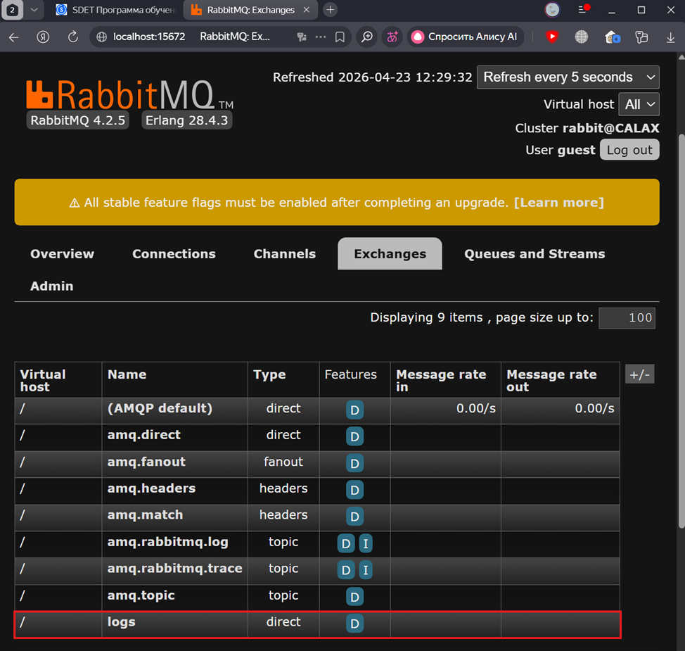
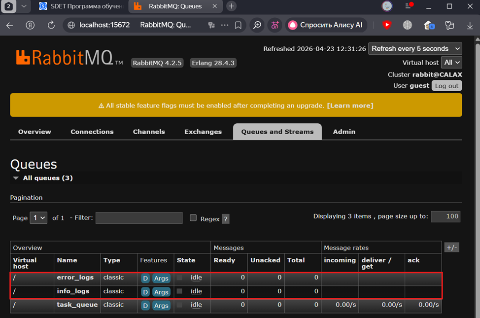
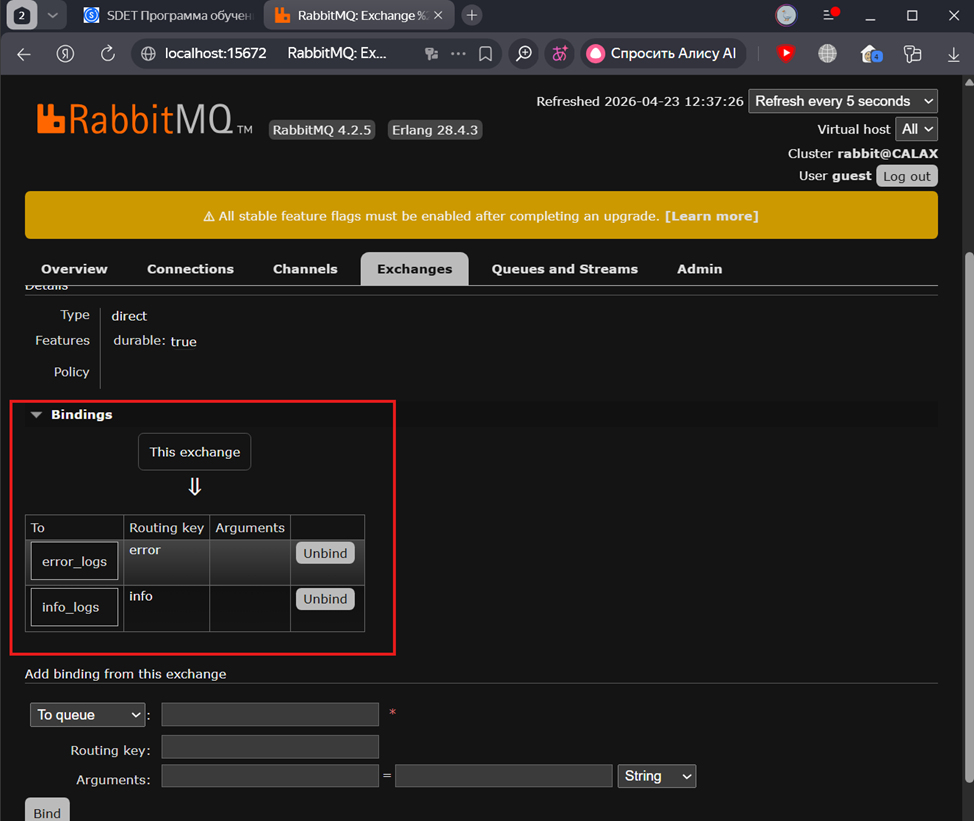
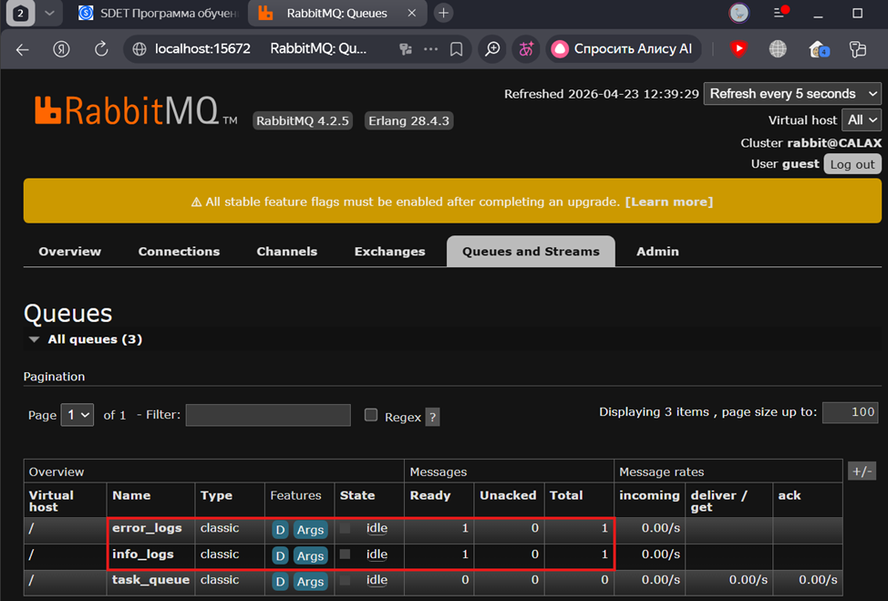
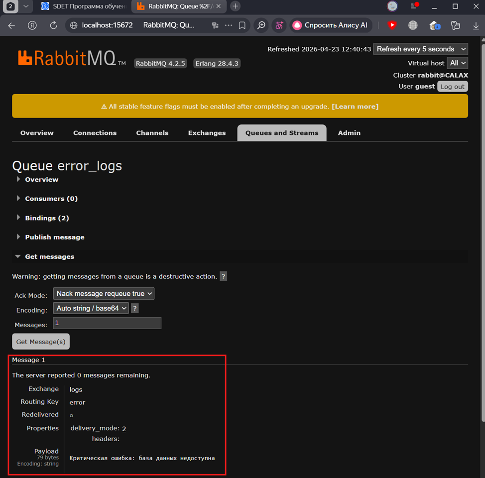
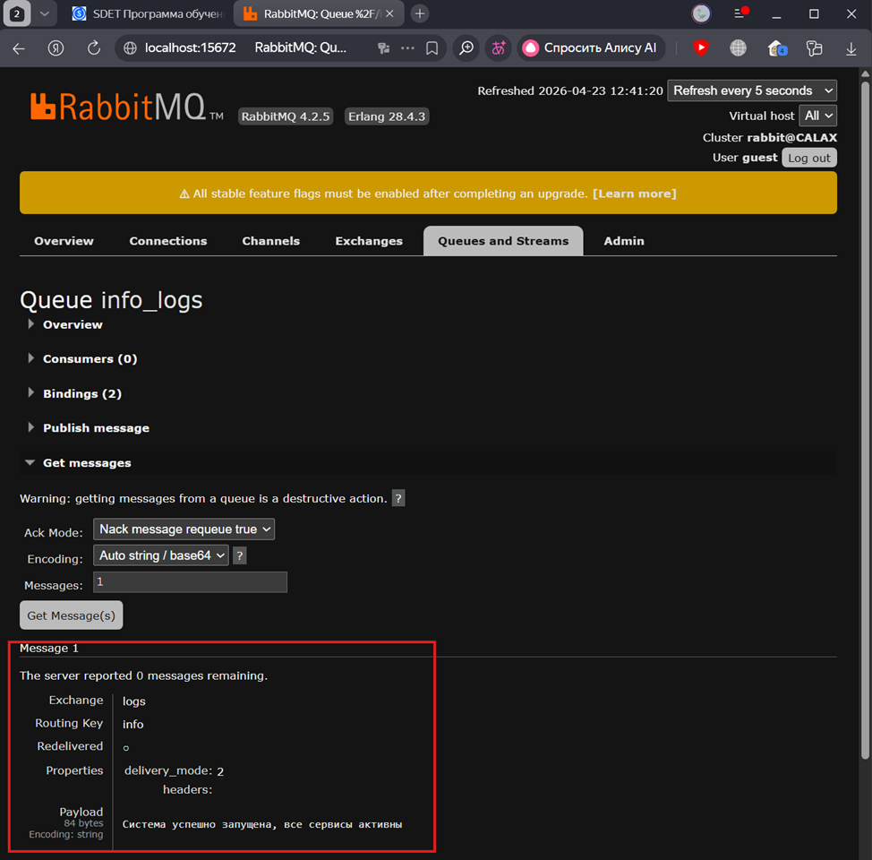

# 🐇 Задание по блоку M: RabbitMQ

**Исполнитель:** Салихов Ильяс  
**Стек:** Python 3.10, pika, RabbitMQ 4.2.5

---

## Задание 1

### 1.1 Создание очереди `task_queue`

📸 Скриншот 1.1: Успешное создание очереди

> *Очередь `task_queue` создана, режим `durable: true`*

---

### 1.2 Отправка сообщения (Producer)

📸 Скриншот 1.2: Успешная отправка сообщений

---

### 1.3 Получение сообщения (Consumer)

📸 Скриншот 1.3: Успешное получение сообщений

---

## Задание 2: Exchange и маршрутизация

### 2.1 Создание Exchange `logs`

📸 Скриншот 2.1: Exchange создан

---

### 2.2 Создание очередей `error_logs` и `info_logs`

📸 Скриншот 2.2: Очереди созданы

---

### 2.3 Привязка очередей (Binding)

📸 Скриншот 2.3: Привязки настроены

---

### 2.4 Отправка сообщений через Exchange `logs`

📸 Скриншот 2.4: Сообщения опубликованы

---

### 2.5 Чтение сообщений

📸 Скриншот 2.5.1: Получение error-сообщений

---

📸 Скриншот 2.5.2: Получение info-сообщений

---

> **Примечание:** Все скриншоты находятся в папке `./screenshots/`. Окружение: Windows 11, Python 3.10, RabbitMQ 4.2.5