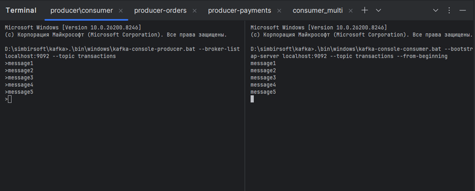
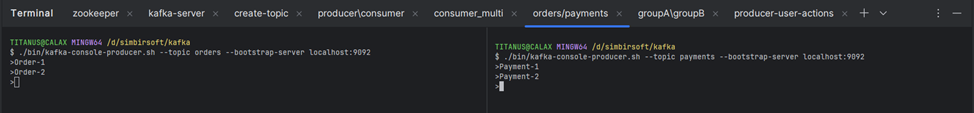
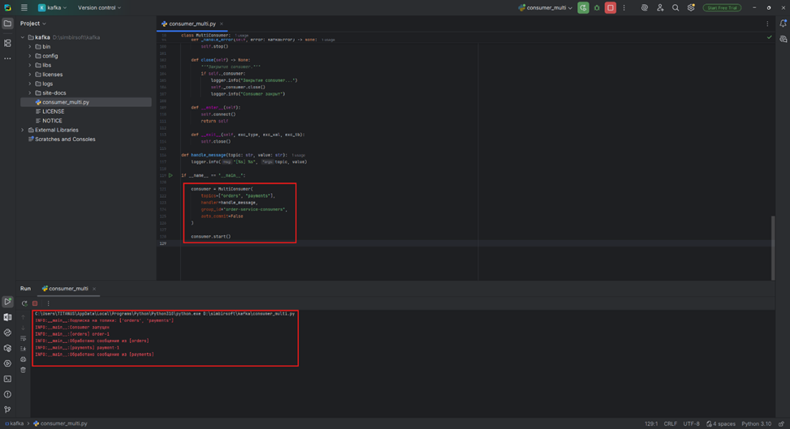
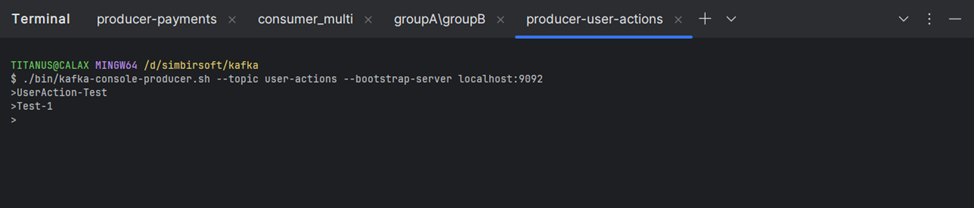
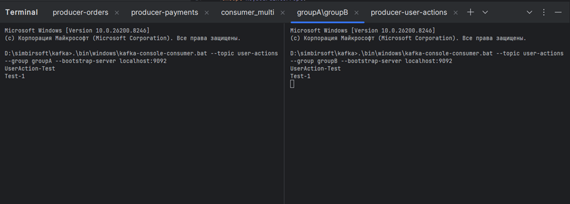

# 🐘 Задание по блоку M: Kafka

**Исполнитель:** Салихов Ильяс  
**Стек:** Python 3.10, kafka, Kafka 3.9.0
---

# Задание 1: Базовая работа с Kafka

---

## 1. Запуск Zookeeper

```bash id="z1"
./bin/windows/zookeeper-server-start.bat config/zookeeper.properties
```

---

## 2. Запуск Kafka Broker

```bash id="z2"
./bin/windows/kafka-server-start.bat config/server.properties
```

---

## 3. Создание топика `transactions`

```bash id="z3"
./bin/windows/kafka-topics.bat --create \
  --topic transactions \
  --bootstrap-server localhost:9092 \
  --partitions 1 \
  --replication-factor 1
```

---

## 4. Отправка сообщений в `transactions`

```bash id="z4"
./bin/windows/kafka-console-producer.bat \
  --topic transactions \
  --bootstrap-server localhost:9092
```

### Отправлено 5 сообщений:

```
message1
message2
message3
message4
message5
```

---

## 5. Чтение сообщений (console consumer)


<details>
<summary>📸 Скриншот 5: Получение сообщений</summary>



</details>

---

#  Задание 2: Несколько топиков

---

## 6. Создание топиков `orders` и `payments`

```bash id="z6"
./bin/windows/kafka-topics.bat --create --topic orders \
  --bootstrap-server localhost:9092

./bin/windows/kafka-topics.bat --create --topic payments \
  --bootstrap-server localhost:9092
```

---

## 7. Разработка consumer (Python)

Consumer читает из:

* `orders`
* `payments`

```bash id="z7"
python consumer_kafka.py
```

---

## 8. Отправка сообщений в `orders` и `payments`

Отправлены разные сообщения в каждый топик:

```
Order-1
Order-2
Payment-1
Payment-2
```

<details>
<summary>📸 Скриншот 8: Отправка сообщений</summary>



</details>

---

## 9. Чтение сообщений consumer’ом


<details>
<summary>📸 Скриншот 9: Получение сообщений</summary>



</details>

---

#  Задание 3: Consumer Groups (groupA / groupB)

---

## 10. Создание топика `user-actions`

```bash id="z9"
./bin/windows/kafka-topics.bat --create \
  --topic user-actions \
  --bootstrap-server localhost:9092
```

---

## 11. Запуск consumer groupA и groupB

### Consumer A:

```bash id="z10"
./bin/windows/kafka-console-consumer.bat --bootstrap-server localhost:9092 \
  --topic --from-beginning --group groupA 
```

### Consumer B:

```bash id="z11"
./bin/windows/kafka-console-consumer.bat --bootstrap-server localhost:9092 --topic --from-beginning --group groupB 
```


---

## 12. Отправка сообщений в `user-actions`

```bash id="z12"
./bin/windows/kafka-console-producer.bat --topic user-actions --bootstrap-server localhost:9092
```

```
UserAction-Test
Test-1
```

<details>
<summary>📸 Скриншот 12: Отправка сообщений</summary>



</details>

---

## 13. Чтение сообщений consumer’ами


<details>
<summary>📸 Скриншот 13: Получение сообщений groupA/groupB</summary>



</details>

---

>  Все скриншоты находятся в папке `./screenshots/kafka_img/`
>  Окружение: Windows 11, Python 3.10, Kafka 3.9.0


